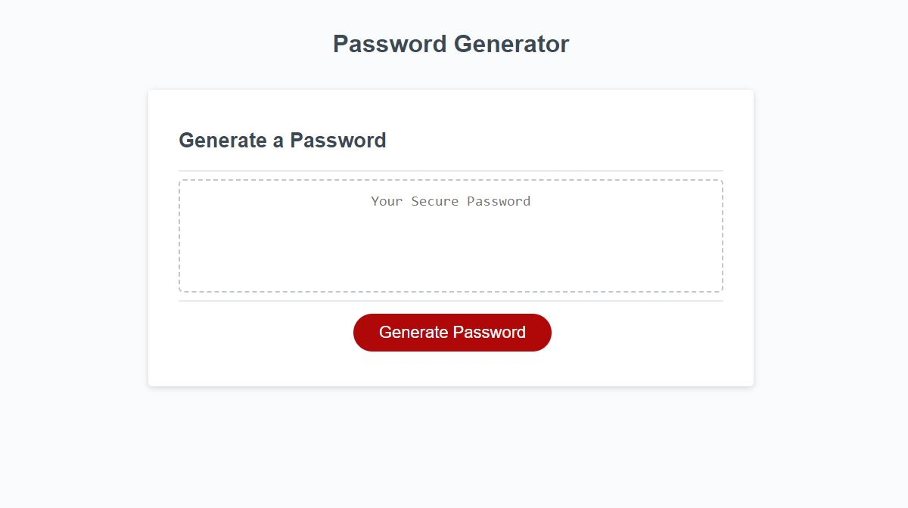

# PASSWORD GENERATOR

## Description
In this project I have refactor code using JavaScript to make an app witch generates a user wanted password

This is result in console:

## Installation
N/A

## Usage
This app will ask user what kind of password he wants, when user answers questions my code will generate a password

Link to live page: [Click here](https://markubil.github.io/Password-Generator/)

## Credits
N/A

## License
 GNU GENERAL PUBLIC LICENSE

 Version 3, 29 June 2007

 Copyright (C) 2007 Free Software Foundation, Inc. <https://fsf.org/>
 Everyone is permitted to copy and distribute verbatim copies
 of this license document, but changing it is not allowed.

## Badges

